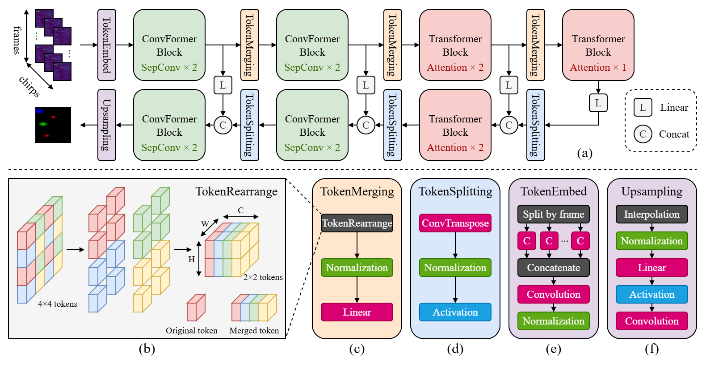

# mRadNet: A Compact Radar Object Detector with MetaFormer

[](https://arxiv.org/abs/2509.16223)

This is the official implementation of mRadNet from the paper [mRadNet: A Compact Radar Object Detector with MetaFormer](https://arxiv.org/abs/2509.16223).



## Data Preparation
* Download the CRUW ROD2021 dataset from https://www.cruwdataset.org/download. Download `TRAIN_RAD_H.zip` and `TRAIN_RAD_H_ANNO.zip`, the camera images and the testing set are not needed. Extract the zip files, and place the files as the following structure:
```cpp
├─ annotations
|  ├─ test                      // 4 sequences - TRAIN_RAD_H_ANNO.zip
|  |  ├─ 2019_04_09_BMS1001.txt
|  |  └─ ...
|  └─ train                     // 36 sequences - TRAIN_RAD_H_ANNO.zip
|     ├─ 2019_04_09_BMS1000.txt
|     └─ ...
└─ sequences
   ├─ test                      // 4 sequences - TRAIN_RAD_H.zip
   |  ├─ 2019_04_09_BMS1001
   |  |  └─ RADAR_RA_H
   |  |     ├─ 000000_0000.npy
   |  |     └─ ...
   |  └─ ...
   └─ train                     // 36 sequences - TRAIN_RAD_H.zip
      |─ 2019_04_09_BMS1000
      |  └─ RADAR_RA_H
      |     ├─ 000000_0000.npy
      |     └─ ...
      └─ ...
```
> [!IMPORTANT]
> The testing sequences are `2019_04_09_BMS1001`, `2019_04_30_MLMS001`, `2019_05_23_PM1S013`, `2019_09_29_ONRD005`, same as [T-RODNet](https://github.com/Zhuanglong2/T-RODNet) and other models.

## Installation
* Clone this repository
* Create a conda environment. mRadnet was tested under Python 3.12 on Ubuntu with Nvidia GPU.
* Install the required packages in [requirements.txt](requirements.txt).
   > [!NOTE]
   > For the `cruw-devkit` package, please refer to intructions [here](https://github.com/yizhou-wang/cruw-devkit). It has not been maintained in recent years so modifications might be needed for it to work.
* Edit the paths in [mRadNet.yaml](config/mRadNet.yaml) to your own paths.

## Training
```sh
python train.py -c mRadNet.yaml
```
## Testing
```sh
python test.py -c mRadNet.yaml -r checkpoint.pt
```

## Acknowledgement
* Thanks to Fahed Hassanat, Robert Laganière and Martin Bouchard for their instructions and resources.
* Thanks to [MetaFormer](https://github.com/sail-sg/metaformer) authors for the lighweight archetecture.
* Thanks to the Yizhou Wang team for making part of [the CRUW dataset](https://www.cruwdataset.org) public.
* Thanks to other research teams including [T-RODNet](https://github.com/Zhuanglong2/T-RODNet) authors and [E-RODNet](https://github.com/lupeng-xm/E-RODNet) authors for their contributions to the ROD field.
